# Kravel
<br>

### Work Flow

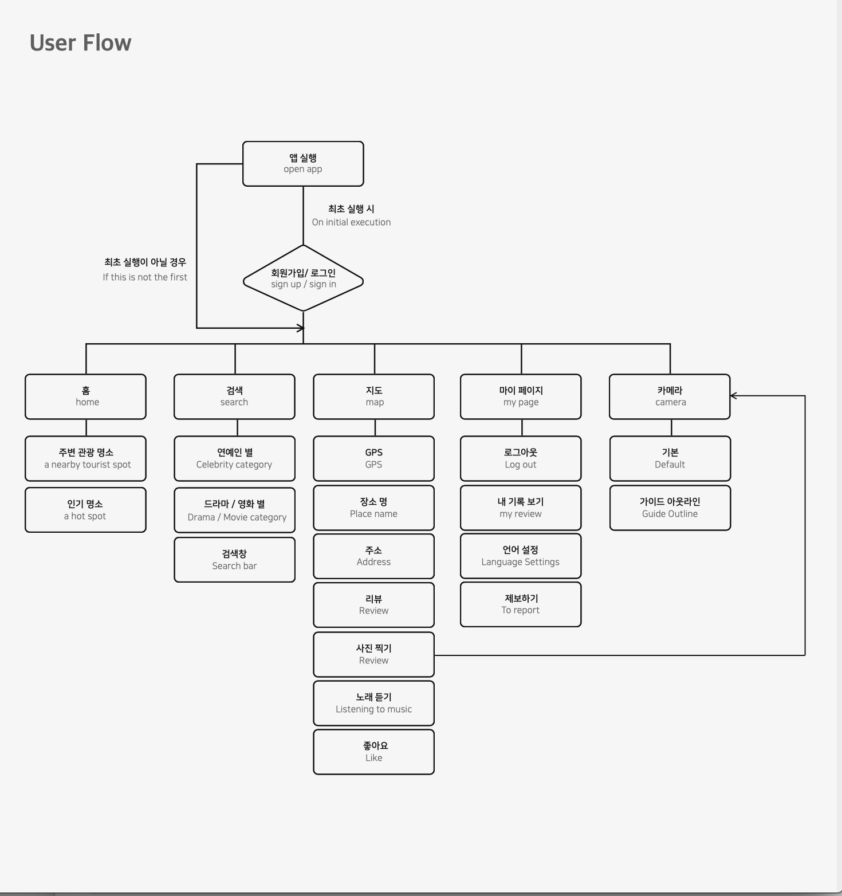

<br>

---

### Convention

* **[Kravel Convention](/docs/Convention.md)**

<br>

---

### 개발 환경

* **Xcode Version 12.1**
* **Swift 5**

<br>

---

### 라이브러리

* **Alamofire 5.2**
* **NMapsMap**
* **lottie-ios**
* **Kingfisher 5.0**

<br>

---

### 실행화면

> **홈 화면**

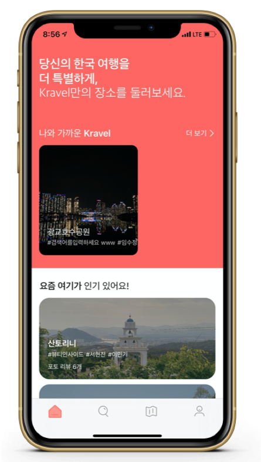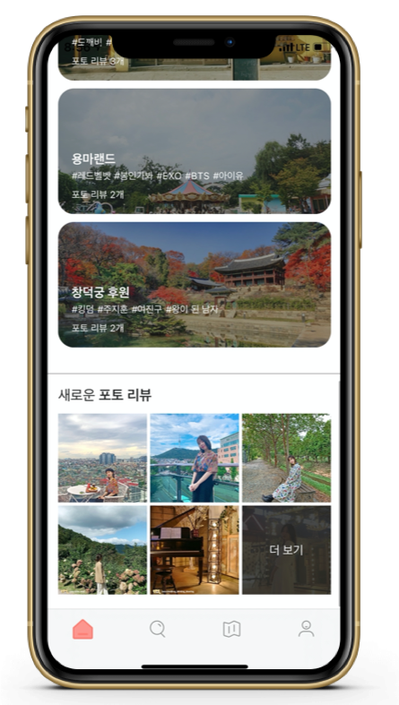

<br>

> **검색 화면**

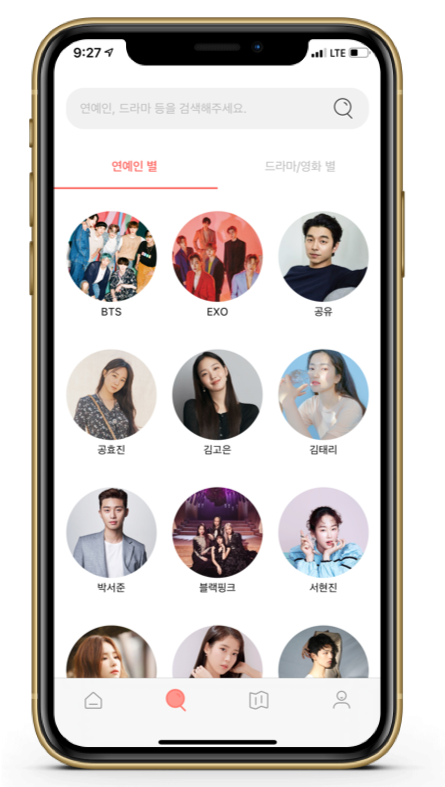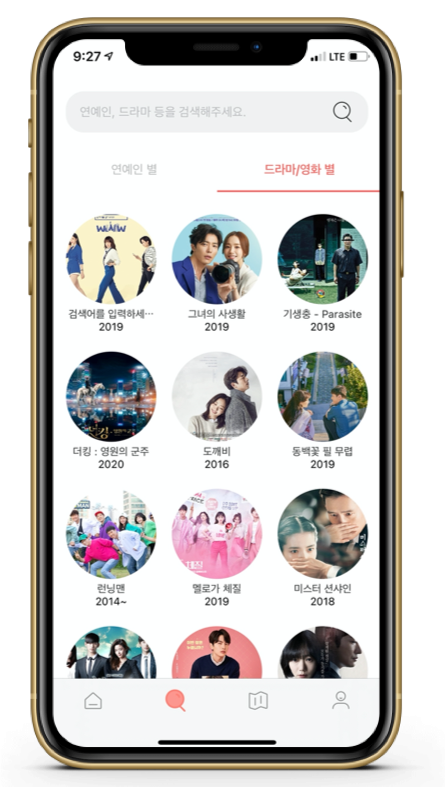

<br>

> **최근 검색어 화면**

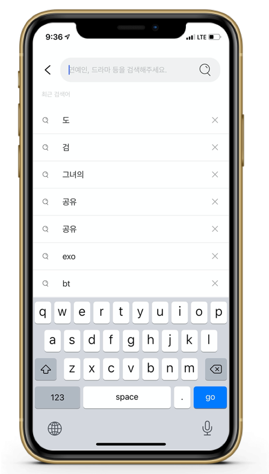

<br>

> **지도 화면**

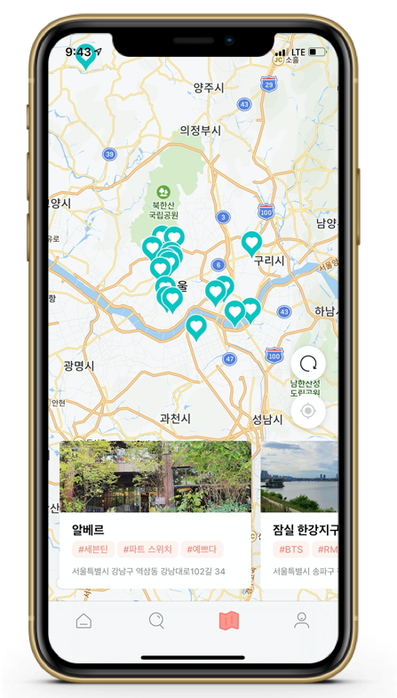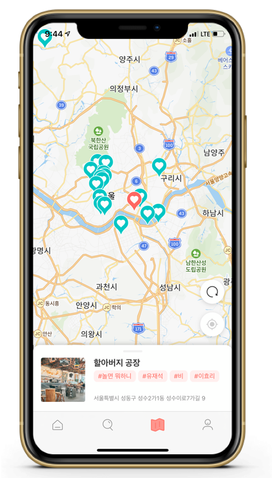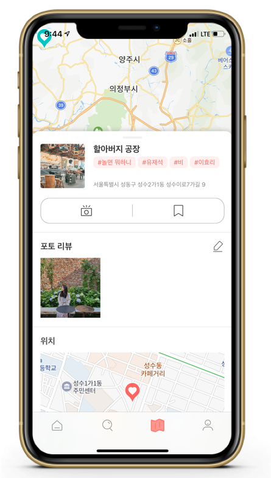

<br>

> **카메라 화면**

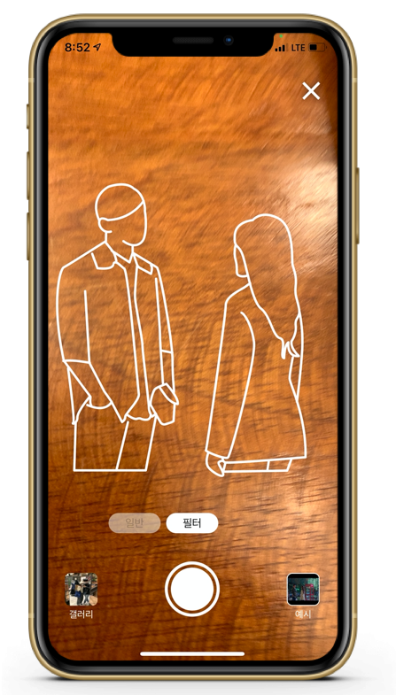

<br>

---

###  🛠 설계 및 구현

<br>

> **검색 화면** - MVC Pattern, Delegate Pattern

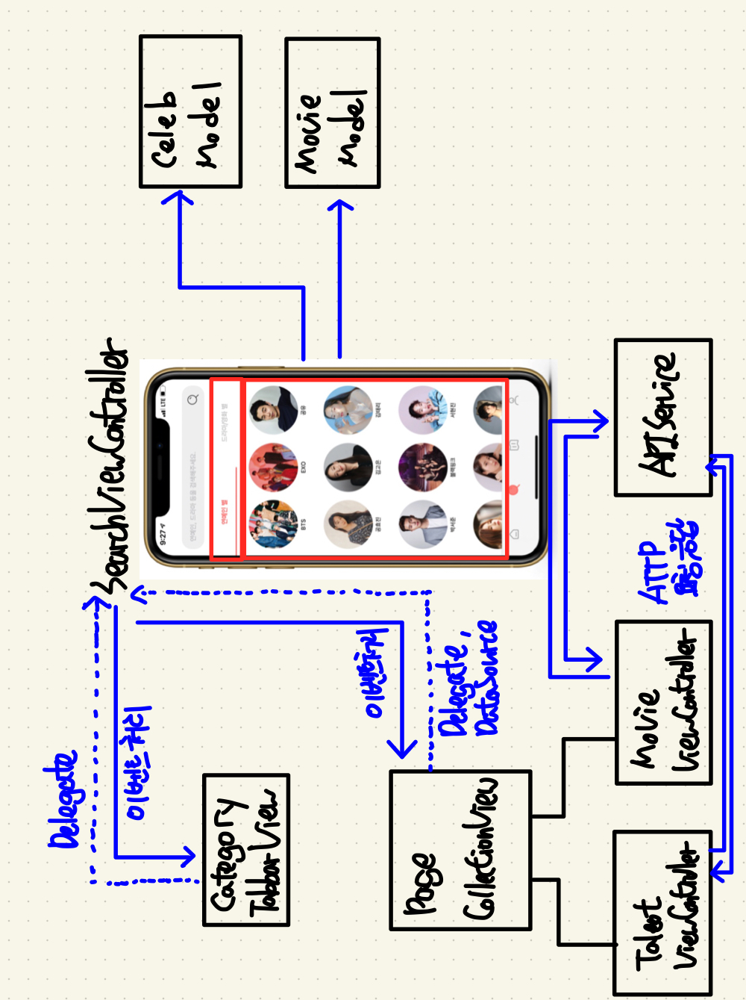

* `MovieViewController` --- `TalentViewController` --- `PageCollectionView` --- `SearchViewController`
  * **PageCollectionView**에서 **ChildViewController**로 **MovieViewController**, **TalentViewController**로 임명 
  * 각 **MovieViewController**, **TalentViewController**가 **Celeb**, **Movie** 모델을 가지고 있는 것이 **SearchViewController**의 역할을 덜어줄 것 같아서 Child로 나눔
  * **CollectionView** 터치 시, Parent로 이벤트를 넘겨서 새로운 화면 띄울 수 있게 처리
  * **MovieViewController**, **TalentViewController**에서 APIService에 HTTP 요청 및 응답하여 데이터 표시
* `CategoryTabbarView` --- `SearchViewController` 
  * **Controller**를 **CategoryTabbarView**의 **Delegate**로 임명
  * CategoryTabbar의 메뉴가 눌렸을 때, Delegate가 PageCollectionView Index로 스크롤 될 수 있게 구현
  * PageCollectionView을 스크롤하면 contentOffset에 나누기 2를 수행해서 CategoryTabbar Indicator View 스크롤될 수 있게 구현

<br>

***고민한 내용***

* CollectionCell 안의 내용들을 SearchViewController에서 로드할 지, Cell안에서 할 지 고민했었습니다.
  * SearchViewController의 역할을 줄여주기 위해서 Cell 안에 ViewController을 넣어서 Parent, Child 관계로 유지하여 Child ViewController 안에서 처리할 수 있게 역할을 나누었습니다.
  * Cell을 Qeueu안에서 꺼내올 때, ChildViewController의 view을 추가해서 바로 사용할 수 있게 구현

<br>

> **최근 검색어 화면** - MVC Pattern, Delegate Pattern

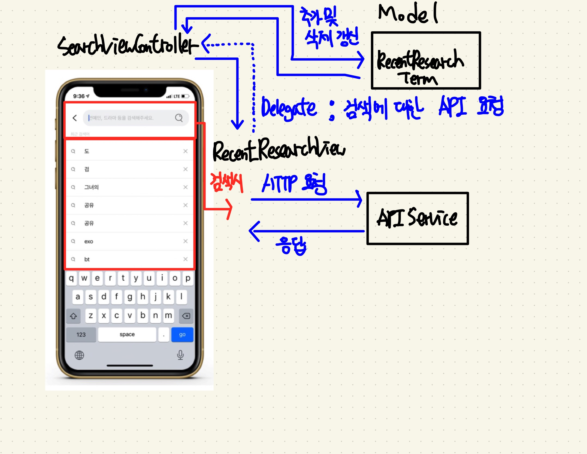

* `RecentReserachView` --- `SearchViewController` --- `RecentResearchTerm` (MVC Pattern)
  * **Controller**에서 **RecentResearchTerm** 데이터 로드
  * **Controller**에서 **RecentResearchView** 화면 업데이트
  * **Controller**를 **RecentResearchView**의 Delegate로 임명 => 검색어 클릭 이벤트 및 삭제 이벤트에 맞는 동작
    * 최근 검색어 클릭 시, Delegate에 검색어 전달 후 APIService Singleton 객체에 API 요청
    * 최근 검색어 클릭 시, Delegate에 검색어 전달 후 RecentResearchTerm에 최근 검색어 추가
    * 최근 검색어 삭제 버튼 클릭 시, RecentResearchTerm 객체에 이벤트 알리고 해당 ID 검색어 삭제
* `SearchViewController` --- `NetworkHandler(APIService)` 객체
  * requestAPI<P: ParameterAble>(_: APICategory<P>, _: @esacping (NetworkResult<Codable>) -> Void) 메소드 요청으로 HTTP 요청
  * completion을 이용, 네트워크 작업 후 **SearchResultDTO** 데이터를 이용 **ResultView** 업데이트
* `RecentResearchView` --- `TableView Cell Button`
  * RecentResearchView을 TableViewCell의 Delegate로 임명
  * Button Click시 해당 Index에 해당하는 `RecentResearchView`에서 최근 검색어 삭제

<br>

***고민한 내용***

* 서로 다른 계층에 이벤트를 전달하기 위해 Delegate를 사용할 지, NotificationCenter을 사용할지 고민
  * NotificationCenter을 사용할 경우 1:N 의 관계에서 이벤트를 전달하기 유용하다. 그러나 1:1의 관계에서 Delegate가 더 효율적이라고 생각했다. - NotificationCenter의 경우 post을 할 때, Observer들을 탐색할 때 비용이 소비되기 때문에

* CoreData에 접근하는데 이 주체를 Controller로 할지, 해당 모델을 가지는 View로 할지
  * MVC Pattern에서 Controller가 중간이 되어야한다고 생각해서 Controller로 부여 - 그러나 너무 Controller가 무거워진 것 같고 이 과정에서 한 단계 더 전달하는 Depth가 생겼다. 그냥 View로 연결하는게 Controller의 과중된 역할도 줄여주고 더 좋았을 것 같다.

<br>

> **지도 화면** - MVC Pattern, Delegate Pattern

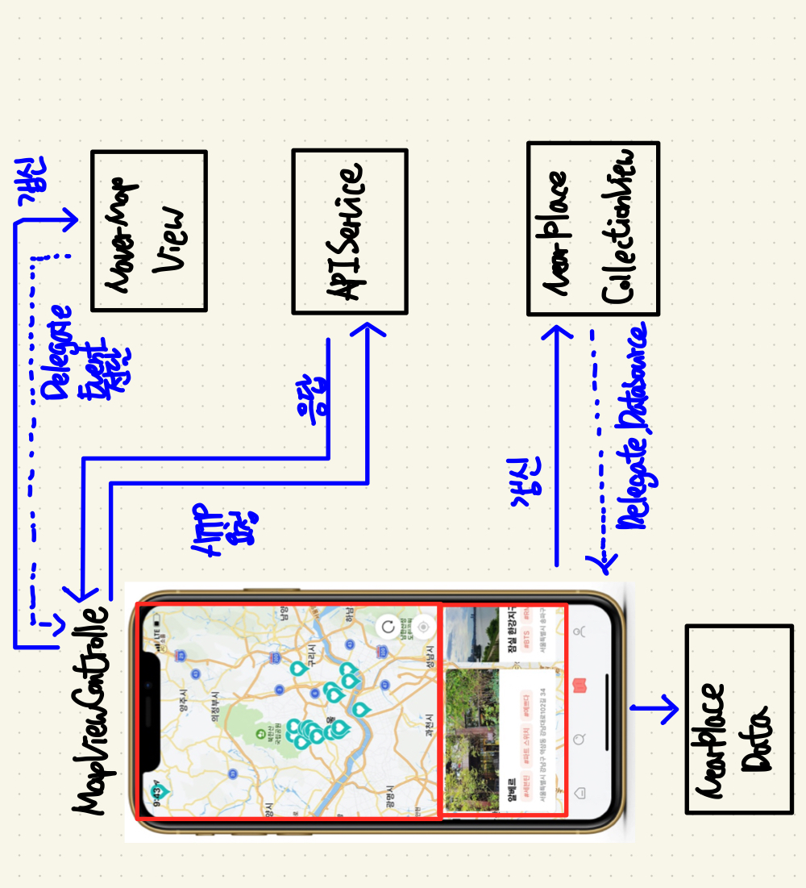

* `NaverMapView` --- `MapViewController` --- `PlaceData` (MVC Pattern)
  * **Controller**에서 **APIService Singleton** 객체 이용 **PlaceData** 데이터 로드
  * **Controller**에서 받은 **PlaceData** 모델을 **NaverMapView** 업데이트 (Marker 표시)
  * **MapViewController**를 **NaverMapView**의 **Delegate**로 임명
    * 카메라 이동의 원인이 Direction Search에 따라 바뀌면 현재 위치 추적 모드 UIImage 바뀌게 구현
* `NearPlaceCollectionView` --- `MapViewController` --- `NearPlaceData`
  * **Controller**에서 **APIService Singleton** 객체 이용 **NearPlaceData** 데이터 로드 (Query로 현재 경도, 위도 삽입)
  * **Controller**에서 받은 **NearPlaceData** 모델을 **NearPlaceCollectionView**에 업데이트 (reloadData이용)
  * **MapViewController**를 **NearPlaceCollectionView**의 **DataSource**, **Delegate로** 임명
    * MapViewController의 데이터를 전달 + 터치 이벤트 전달

<br>

***고민한 내용***

* Marker에 해당하는 데이터를 받아올 때, 모든 장소를 받아올 지 현재 카메라에 해당하는 장소만 받아올 지 고민
  * 카메라를 이동할 때마다 많은 이벤트가 발생해서 그 때마다 Networking이 일어나면 비용이 너무 많이 들 것 같아서 데이터가 너무 많지 않은 지금은 지도에 표시하는 데이터를 간편화(id, Longitude, Latitude) 시켜서 전부 표시되게 하였습니다. 
  * 데이터가 많아졌을 때는, 현재 로딩중인지를 표시하는 변수를 두고 로딩중이지 않을 경우에 API 요청을 보내는 방식으로 리모델링하는게 좋을 것 같다.

<br>

---

### 📕 새롭게 알게 된 것

<br>

**1️⃣ Cell에 Shadow + CornerRadius 같이 적용하기**

```swift
// 우선 Shadow을 지정하기 위해선 clipsToBounds 설정이 false여야한다.
// 그러나 CornerRadius을 위해선 clipsToBounds 설정이 true여야한다.
// 여기서 서로 다르기 때문에 Cell에 동시에 지정하기 위해 ContentView을 활용한다.
func collectionView(_ collectionView: UICollectionView, cellForItemAt indexPath: IndexPath) -> UICollectionViewCell {
  guard let nearPlaceCell = collectionView.dequeueReusableCell(withReuseIdentifier: NearPlaceCell.identifier, for: indexPath) as? NearPlaceCell else { return UICollectionViewCell() }
  
  // 내용을 표시하기 위한 View의 layer을 둥글게 만들어 표시
  nearPlaceCell.contentView.layer.cornerRadius = nearPlaceCell.contentView.frame.width / 49.6
  nearPlaceCell.contentView.clipsToBounds = true
  
  // 그림자 효과를 위해 바깥 Cell에 Shadow 표시
  nearPlaceCell.makeShadow(color: UIColor.black, blur: 10, x: 3, y: 2)
  nearPlaceCell.clipsToBounds = false
  
  return nearPlaceCell
}
```

<br>

**2️⃣ `Alamofire` 4.8 Version만 사용하다가 `Alamofire` 5.2 Version의 사용법**

```swift
// validate을 통해서 처리하지 않는 statusCode가 날라올 경우 failure 처리를 한다.
// responseDecodable을 통해 통신에 성공한 경우 개발자가 별도의 Decoding 처리 없이 Decoding된 데이터를 받을 수 있다.
func requestSignup(_ url: String, _ headers: HTTPHeaders?, _ parameters: Parameters?, _ completion: @escaping (NetworkResult<Codable>) -> Void) {
  guard let url = try? url.asURL() else { return }
  
  AF.request(url, method: .post, parameters: parameters, encoding: JSONEncoding.default, headers: headers)
  	.validate(statusCode: 200...500)
  	.responseDecodable(of: APIResponseData<APICantSortableDataResult<SignupResponse>, APIError>.self) {
      response in
      switch response.result {
        case .sucess(let signupResponse):
        	guard let statusCode = response.response?.statusCode else { return }
        	completion(.success(signupResponse))
        case .failure:
        	completion(.networkFail)
      }
    }
}
```

<br>

**3️⃣ `Core Data` 사용해서 데이터 저장하기**

[Core Data 정리 블로그 작성 (1/2)](https://dongminyoon.tistory.com/3?category=419821)

[Core Data 정리 블로그 작성 (2/2)](https://dongminyoon.tistory.com/6?category=419821)

<br>

**4️⃣ `AVFoundation` 이용 Custom Camera 구현**

```swift
import AVFoundation

class CameraVC: UIViewController {
  var captureSession = AVCaptureSession()
  var videoPreviewLayer: AVCaptureVideoPreviewLayer?
  var cemeraDevice: AVCaptureDevice?
  var cameraOutput: AVCapturePhotoOutput?
  
  private func configureCameraDevice() {
    guard let captureDevice = AVCaptureDevice.default(.builtInWideAngleCamera, for: .video, position: .back) else { 
      print("Failed to get the camera device")
    	return
    }
    
    cameraDevice = captureDevice
  }
  
  private func configureInputData() {
    if let cameraDevice = self.cameraDevice {
      do {
        let input = try AVCaptureDeviceInput(device: cameraDevice)
        if captureSession.canAddInput(input) { captureSession.addInput(input) }
      } catch {
        print(error.localizedDescription)
        return
      }
    }
	}
  
  private func configureCameraOutputData() {
    cameraOutput = AVCapturePhotoOutput()
    if let cameraOutput = self.cameraOutput {
      if captureSession.canAddOutput(cameraOutput) { captureSession.addOutput(cameraOutput) }
    }
  }
  
  private func displayPreview() {
    videoPreviewLayer = AVCaptureVideoPreviewLayer(session: captureSession)
    videoPreviewLayer?.videoGravity = AVLayerVideoGravity.resizeAspectFill
    DispatchQueue.main.async {
      self.videoPreviewLayer?.frame = self.view.layer.bounds
      self.view.layer.addSublayer(self.videoPreviewLayer!)
    }
    
    DispatchQueue.global(qos: .userInitiated).async {
      self.captureSession.startRunning()
    }
  }
  
  private func setCameraView() {
    configureCameraDevice()
    configureInputData()
    configureCameraOutputData()
    configureCameraOutputData()
    displayPreview()
  }
}
```

<br>

**5️⃣ API 요청 GET 메소드 사용시 Query문 사용하기**

```swift
// Get Method의 경우 Query문을 작성할 수 있다.
// URLEncoding.queryString을 활용해 parameter을 Query로 디코딩 할 수 있다.
private func requestSearchPlace(_ url: String, _ headers: HTTPHeaders?, _ completion: @escaping (NetworkResult<Codable>) -> Void) {
  guard let url = try? url.asURL() else { return }
  
  let query = [
    "page": 1,
    "offset": 2
  ]
  
  AF.request(url, method: .get, parameters: query, encoding: URLEncoding.queryString, headers: headers)
  	.validate(statusCode: 200...500)
  	.responseDecodable(of: SearchPlaceResponse) {
      response in
      switch response.result {
			case .success(let placeResult):
        guard let statusCode = response.response?.statusCode else { return }
        if statusCode == 200 { completion(.success(placeResult)) }
				else { completion(.networkFail) }
     	case .failure(let error):
				print(error.localizedDescription)
        completion(.networkFail)
      }
    }
}
```

<br>

**6️⃣ ScrollView 사용시 또 다른 Pan Gesture 사용하고 싶을 때 설정하기**

```swift
// 원래의 경우엔 ScrollView의 기본 Pan Gesture이 지정되어 있기 때문에,
// 또 다른 Pan Gesture을 지정해도 작동되지 않는다.
// 이 경우에 작동하고 싶을 경우, UIGestureRecognizerDelegate을 활용해서 같이 지정할 수 있다.

// 내려서 화면을 종료하고 싶으면서, Scroll도 별도로 내려가게 하기 위해 작성했다.
extension LocationDetailVC: UIGestureRecognizerDelegate {
  func addGesture() {
    let panGesture = UIPanGestureRecognizer(target: self, action: #selector(somthing(_:)))
    panGesture.delegate = self
    contentScrollView.addGestureRecognizer(panGesture)
  }
  
  // 이 설정으로 동시에 두 가지의 Pan Gesture가 사용 가능하다.
  func gestureRecognizer(_ gestureRecognizer: UIGestureRecognizer, shouldRecognizeSimultaneouslyWith otherGestureRecognizer: UIGestureRecognizer) -> Bool {
    return true
  }
}
```

<br>

**7️⃣ TableView Pagination 구현**

```swift

```

<br>

**8️⃣ 다크 모드 지원 막기**

```swift
// SceneDelegated에 구현하기
if #available(iOS 13.0, *) {
  self.window?.overrideUserInterfaceStyle = .light
}
```

<br>

**9️⃣ CollectionView Paging 구현**

> **블로그 작성 예정**

<br>

**🔟 ScrollView 당겨서 새로고침 구현**

```swift
@IBOutlet weak var contentScrollView: UIScrollView! {
  didSet {
    contentScrollView.delegate = self
  }
}

private func setRefreshView() {
  let refreshControl = UIRefreshControl()
  refreshControl.addTarget(self, action: #selector(reload), for: .valueChanged)
  contentScrollView.refreshControl = refreshControl
}

@objc private func reload() {
  print("Reload 데이터 설정")
  // 설정이 끝난 후, Refresh 끝내기
  contentScrollView.refreshControl?.endRefreshing()
}
```

